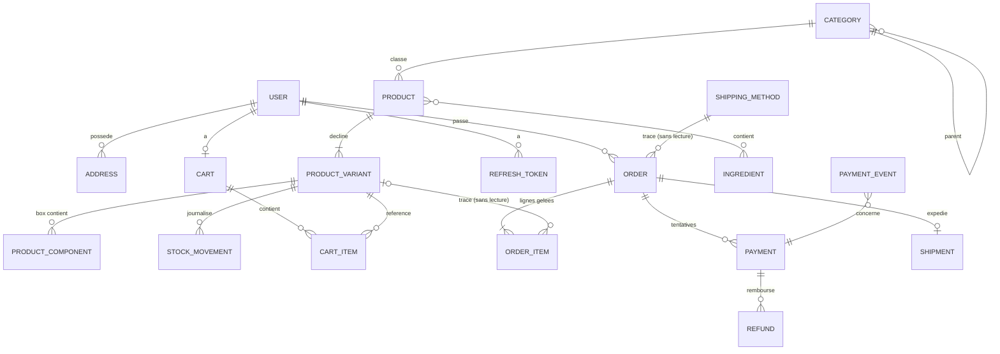

# Modèle de données — MVP (T-003)

> Découle de [`DECISIONS.md`](DECISIONS.md) (D-004 à D-019) et de [`ARCHITECTURE.md`](ARCHITECTURE.md).
> Le contrat d'API correspondant est dans [`API.md`](API.md) et [`contract/openapi.yaml`](contract/openapi.yaml).

## Conventions communes

| Règle | Détail |
|---|---|
| Clé primaire | `id uuid` (`@PrimaryGeneratedColumn('uuid')`) |
| Horodatage | `createdAt`, `updatedAt` (`timestamptz`) sur **toutes** les tables, via `BaseEntity` |
| Montants | `integer`, **en centimes**, suffixe `Cents`. Jamais de `float`, `decimal` ou `numeric` |
| Taux | `integer` en **points de base**, suffixe `Bps` (550 = 5,5 %, 2000 = 20 %) |
| Enums | Type `enum` PostgreSQL, valeurs en `UPPER_SNAKE_CASE` |
| Suppression | Les données vendues ne sont **jamais supprimées**. Produits et variantes ont un champ `archived` |
| Contraintes | Les invariants sont aussi posés en base (`CHECK`, `UNIQUE`) et pas seulement dans le code |

## Diagramme



## Compte — `users`

### `User`
| Champ | Type | Contraintes | Note |
|---|---|---|---|
| email | varchar(254) | UNIQUE, stocké en minuscules | |
| passwordHash | varchar | NOT NULL | bcrypt, coût 12 ; jamais exposé par l'API |
| firstName / lastName | varchar(100) | NOT NULL | |
| phone | varchar(20) | NULL | |
| role | enum `Role` | défaut `CUSTOMER` | `CUSTOMER`, `ADMIN` |

### `Address` (P1 : US-048, prête pour le checkout)
| Champ | Type | Contraintes |
|---|---|---|
| userId | uuid FK → User | ON DELETE CASCADE |
| label | varchar(50) | NULL (« Maison »…) |
| firstName, lastName | varchar(100) | NOT NULL |
| line1 / line2 | varchar(200) | line2 NULL |
| postalCode | varchar(5) | `^\d{5}$` et ne commence pas par `20` (D-003) |
| city | varchar(100) | NOT NULL |
| country | char(2) | `CHECK (country = 'FR')` (D-003) |
| phone | varchar(20) | NOT NULL (exigé par le transporteur) |
| isDefault | boolean | une seule à `true` par utilisateur (index unique partiel) |

### `RefreshToken` (D-019)
`userId`, `tokenHash` (UNIQUE), `expiresAt`, `revokedAt` NULL, `replacedById` NULL.

## Catalogue — `categories`, `products`, `stock`

### `Category`
| Champ | Type | Contraintes |
|---|---|---|
| name | varchar(100) | NOT NULL |
| slug | varchar(120) | UNIQUE |
| description | text | NULL |
| parentId | uuid FK → Category | NULL (arborescence à 2 niveaux max) |
| position | int | tri d'affichage |

### `Product` (la fiche)
| Champ | Type | Contraintes | Note |
|---|---|---|---|
| name | varchar(150) | NOT NULL | |
| slug | varchar(170) | UNIQUE | URL de la fiche |
| type | enum `ProductType` | NOT NULL | `TEA`, `COFFEE`, `CBD`, `BOX`, `ADVENT_CALENDAR`, `ACCESSORY` (D-001) |
| shortDescription | varchar(300) | NULL | |
| description | text | NULL | Markdown |
| categoryId | uuid FK → Category | NOT NULL, ON DELETE RESTRICT | |
| vatRateBps | int | `CHECK (vatRateBps IN (550, 2000))` | D-005, D-006 |
| ageRestricted | boolean | défaut `false` (`true` si CBD) | D-002 |
| origin | varchar(100) | NULL | « Chine, Yunnan » |
| attributes | jsonb | défaut `{}` | intensité, caféine, % CBD, temps d'infusion… (servent aux filtres US-016) |
| images | jsonb | défaut `[]` | `[{url, alt}]` |
| archived | boolean | défaut `false` | US-082 |

### `ProductVariant` (le SKU, D-016)
| Champ | Type | Contraintes | Note |
|---|---|---|---|
| productId | uuid FK → Product | ON DELETE RESTRICT | |
| sku | varchar(40) | UNIQUE | `EG-100G` |
| label | varchar(60) | NOT NULL | « 100 g », « Grains 250 g » |
| priceCents | int | `CHECK (priceCents > 0)` | **TTC** (D-005) |
| weightGrams | int | `CHECK (weightGrams > 0)` | pour le transporteur |
| stockQuantity | int | `CHECK (stockQuantity >= 0)` | stock disponible, réservations déduites (D-011) |
| position | int | | ordre du sélecteur |
| archived | boolean | défaut `false` | |

> La disponibilité exposée (US-004) est **dérivée** : `IN_STOCK` (> 5), `LOW_STOCK` (1 à 5), `OUT_OF_STOCK` (0). Le seuil est configurable. L'API publique n'expose pas la quantité exacte.

### `Ingredient` + table de jointure `product_ingredients` (US-015)
`name`, `slug` UNIQUE.

### `ProductComponent` (contenu d'une box ou du Calendrier, D-001 et D-006)
| Champ | Type | Contraintes |
|---|---|---|
| parentVariantId | uuid FK → ProductVariant | variante de type `BOX` / `ADVENT_CALENDAR` |
| componentVariantId | uuid FK → ProductVariant | |
| quantity | int | `CHECK (quantity > 0)` |
| position | int | jour du calendrier (1 à 24) |

### `StockMovement` (journal, D-011)
| Champ | Type | Note |
|---|---|---|
| variantId | uuid FK | |
| type | enum | `RESERVATION`, `RELEASE`, `SALE`, `RETURN`, `ADJUSTMENT` |
| delta | int | signé : −2 pour une réservation de 2 |
| orderId | uuid FK NULL | |
| reason | varchar(200) NULL | obligatoire si `ADJUSTMENT` |
| actorId | uuid FK → User NULL | admin à l'origine d'un ajustement |

> Invariant : `ProductVariant.stockQuantity` = somme des `delta` de ses mouvements. Les deux sont mis à jour dans la **même transaction**, avec `SELECT … FOR UPDATE` sur la variante.

## Panier — `cart`

### `Cart`
`userId` UNIQUE (un panier par compte, D-013 et D-017). Aucun montant n'est stocké : **le total est recalculé à chaque lecture** à partir des prix actuels.

### `CartItem`
| Champ | Type | Contraintes |
|---|---|---|
| cartId | uuid FK → Cart | ON DELETE CASCADE |
| variantId | uuid FK → ProductVariant | |
| quantity | int | `CHECK (quantity BETWEEN 1 AND 99)` |
| | | UNIQUE (`cartId`, `variantId`) : ajouter une variante déjà présente incrémente sa ligne |

## Livraison — `shipping`

### `ShippingMethod` (D-008)
| Champ | Type | Note |
|---|---|---|
| code | varchar(30) UNIQUE | `RELAY`, `HOME` |
| name | varchar(100) | « Point relais » |
| carrier | varchar(50) | O-3 |
| priceCents | int | TTC |
| freeFromCents | int NULL | 4900 = offerte dès 49 € d'articles |
| estimatedDaysMin / Max | int | |
| active | boolean | |

### `Shipment` (P1 : US-053, US-054)
`orderId` UNIQUE, `carrier`, `trackingNumber`, `trackingUrl`, `shippedAt`, `deliveredAt`.

## Commande — `orders` (photo figée au moment de l'achat)

### `Order`
| Champ | Type | Note |
|---|---|---|
| number | varchar(20) UNIQUE | `BR-2026-000123`, issu d'une séquence PostgreSQL |
| userId | uuid FK → User | ON DELETE RESTRICT |
| status | enum `OrderStatus` | voir [états](API.md#états-commande-et-paiement) |
| currency | char(3) | `'EUR'` (D-004) |
| itemsTotalCents | int | somme des `lineTotalCents` |
| discountCents | int | défaut 0 (codes promo en P1, D-014) |
| shippingCents | int | après application de la livraison offerte |
| totalCents | int | `CHECK (totalCents = itemsTotalCents - discountCents + shippingCents)` |
| vatBreakdown | jsonb | `[{rateBps, baseCents, vatCents, totalCents}]`, calculé une fois (D-007, D-009) |
| shippingAddress | jsonb | **copie** de l'adresse : `{firstName, lastName, line1, line2, postalCode, city, country, phone}` |
| shippingMethodCode / shippingMethodName | varchar | **copies** |
| ageDeclaredAt | timestamptz NULL | obligatoire si une ligne est `ageRestricted` (D-002) |
| reservationExpiresAt | timestamptz | `createdAt + 30 min` (D-011) |
| paidAt / cancelledAt | timestamptz NULL | |
| cancellationReason | enum NULL | `PAYMENT_EXPIRED`, `CUSTOMER`, `ADMIN` |
| refundedCents | int | défaut 0, `CHECK (refundedCents <= totalCents)` |

### `OrderItem` (prix et composition gelés)
| Champ | Type | Note |
|---|---|---|
| orderId | uuid FK → Order | ON DELETE CASCADE |
| variantId | uuid FK → ProductVariant NULL | **traçabilité uniquement**, ON DELETE SET NULL |
| productName | varchar | copie |
| variantLabel | varchar | copie |
| sku | varchar | copie |
| productType | enum | copie |
| unitPriceCents | int | copie du prix TTC au moment de la commande |
| vatRateBps | int | copie |
| quantity | int | `CHECK (quantity > 0)` |
| lineTotalCents | int | `unitPriceCents × quantity` |
| ageRestricted | boolean | copie |
| components | jsonb NULL | pour une box : `[{sku, productName, variantLabel, quantity}]` copiés |
| imageUrl | varchar NULL | copie de la première image |

**Règle du gel (critère 2 de T-003) :** l'affichage d'une commande (client ou admin) lit **seulement** `Order` et `OrderItem`, sans jointure vers le catalogue. Modifier le prix, le nom ou la composition d'un produit, ou l'archiver, ne change donc aucune commande. Un test e2e le vérifie :
1. créer une commande ;
2. modifier le prix, le nom et la composition du produit, puis l'archiver ;
3. faire un `GET /orders/:id` : la réponse doit être identique à l'étape 1.

## Paiement — `payments` (D-012, D-015)

### `Payment` (une ligne par tentative = une session Stripe Checkout)
| Champ | Type | Note |
|---|---|---|
| orderId | uuid FK → Order | |
| provider | varchar(20) | `'STRIPE'` |
| providerSessionId | varchar UNIQUE | `cs_…` |
| providerPaymentIntentId | varchar NULL UNIQUE | `pi_…`, connu après paiement |
| status | enum `PaymentStatus` | `PENDING`, `SUCCEEDED`, `FAILED`, `EXPIRED` |
| amountCents | int | = `Order.totalCents` au moment de la tentative |
| currency | char(3) | `'EUR'` |
| failureCode / failureMessage | varchar NULL | US-034 |
| succeededAt | timestamptz NULL | |

### `Refund` (P1 : US-036, US-037)
`paymentId`, `amountCents` (`CHECK > 0`), `reason`, `status` (`PENDING`, `SUCCEEDED`, `FAILED`), `providerRefundId` UNIQUE, `actorId` (admin).

### `PaymentEvent` (idempotence des webhooks)
`providerEventId` UNIQUE (`evt_…`), `type`, `payload` jsonb, `processedAt`, `paymentId` NULL. Un événement déjà présent est ignoré.

## Montants sans approximation flottante (critère 3 de T-003)

1. **Stockage** : `integer` PostgreSQL (borne : 21 474 836,47 €, largement suffisant). On n'utilise pas `bigint`, que le driver `pg` renvoie sous forme de chaîne.
2. **API** : entiers JSON en centimes (`"totalCents": 4660`). Le front ne fait **que** les afficher, avec `Intl.NumberFormat('fr-FR', {style: 'currency', currency: 'EUR'}).format(cents / 100)`, et ne recalcule jamais un total.
3. **Calcul côté serveur** : uniquement des entiers. La seule division arrondie passe par un utilitaire unique (`common/utils/money.util.ts`) :
   ```ts
   // arrondi half-up de a / b, pour a >= 0 et b > 0 entiers
   export const divRoundHalfUp = (a: number, b: number) => Math.floor((2 * a + b) / (2 * b));
   // TVA incluse dans un montant TTC
   export const vatFromGross = (grossCents: number, rateBps: number) =>
     divRoundHalfUp(grossCents * rateBps, 10_000 + rateBps);
   ```
   Tous les produits intermédiaires restent sous `Number.MAX_SAFE_INTEGER` (2^53), donc le calcul est exact.
4. **Ventilation** (livraison, remise) : chaque part est arrondie avec `divRoundHalfUp`, et la dernière reçoit le reste (D-007).
5. **Test de référence** : la commande témoin de `DECISIONS.md` (46,60 € dont 4,37 € de TVA) devient un test unitaire.
